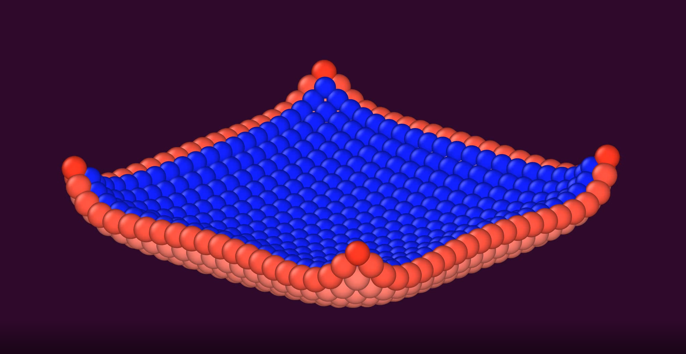
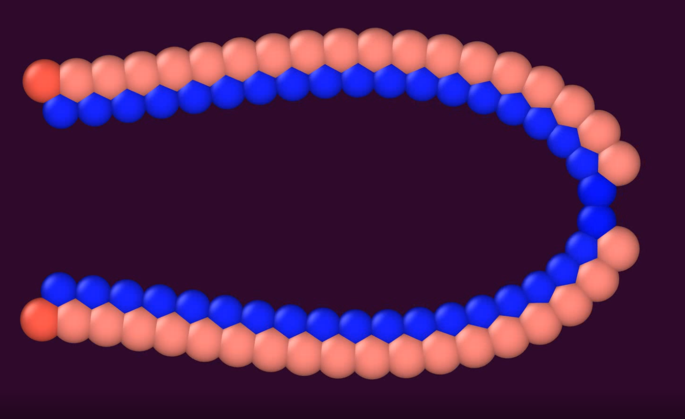
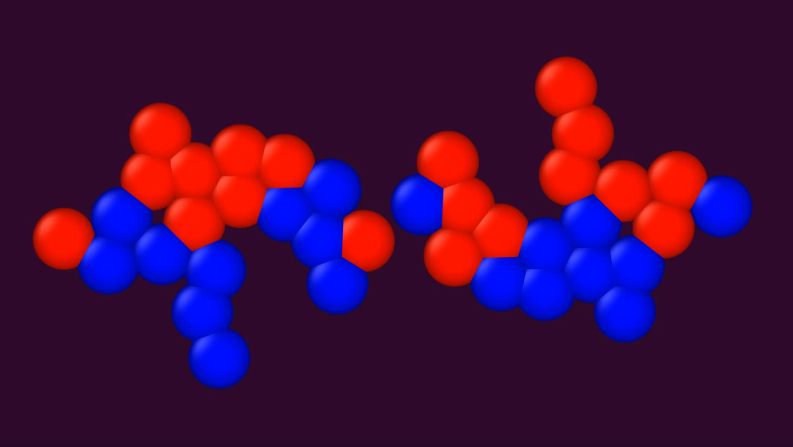
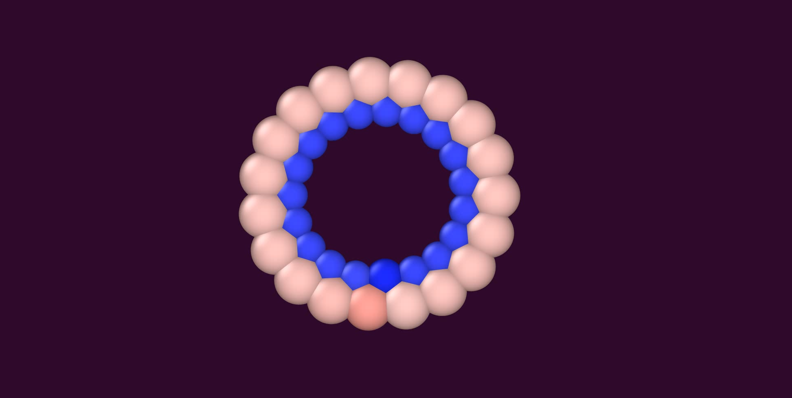
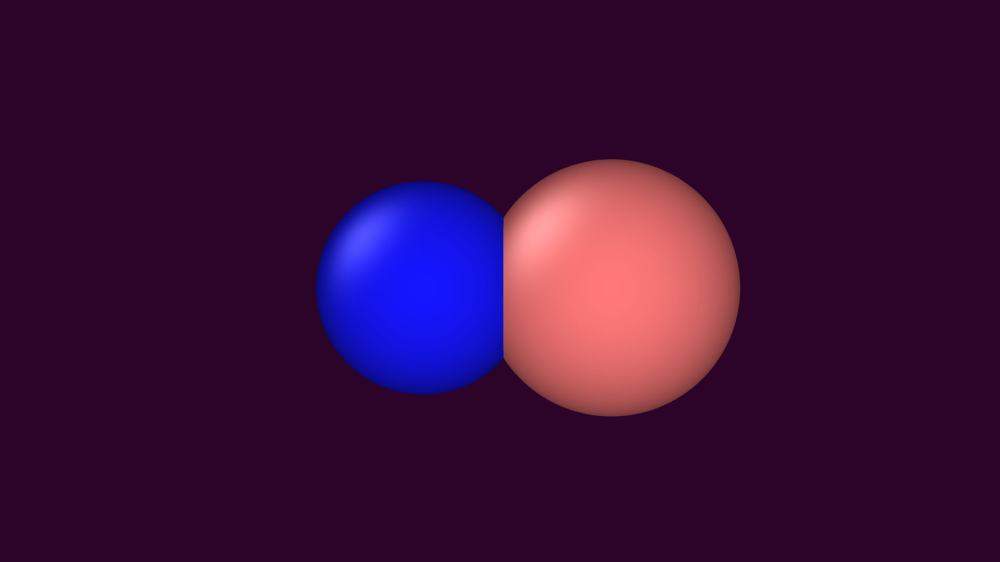

# natedrop.jl







**"Simulate 3D printed droplet arrays, quickly and easily"** 

natedrop.jl is a **particle simulation** for printed, lipid coated aqueous droplets that adhere to each other and form stable lipid bilayers. These droplets can be arranged in networks that display large scale emergent behavior. Currently the modelling of the adhesion between droplets is approximated by a linear spring of stiffness, k. Additionally, water can flow through the bilayers from a region of low osmolarity to a region of high osmolarity through the circular area of intersection between droplets. Both of these relationships can, in tandem, lead to dynamic folding and unfolding of droplets arrays, which can form shapes not possible through simple printing. The folding and unfolding behavior can also lead to future application in the field of soft robotics. The nominal values are calculated through a second order ordinary differential equation on a fixed time step. When the simulation is done running, an xyz file will be printed that can be run within visualization software. 

## How to use: 

### Setting up the inital droplet configuration as a matrix
each droplet in natedrop is represented as a row in a matrix. Each row will have eight columns, and each column will represent a specific parameter:
- Column 1: Radius 
- Column 2: Osmolarity
- Column 3: X-position
- Column 4: Y-position
- Column 5: Z-position 
- Column 6: X-velocity
- Column 7: Y-velocity
- Column 8: Z-velocity

There may be as many rows, and therefore as many droplets as desired. A recommended initial radius is 3 for all droplets. A recommended osmolarity would be either 0.1 or 1 for your droplets. 
### Specifying the other parameters that need to be fed into the function. 
- Additionally, the natural length between each droplet, **L** needs to be specified for the function. A lower **L**-value will have the droplets stick closer together. A recommended **L**-value is 0.8 
- The bilayer attraction is represented as a linear spring of stiffness **K**. A recommended K-value is 1000.0
- Instead of treating each droplet mass as constant, a density of **rho** is instead used. A recommended **rho** value is 0.2 
- The damping coefficient, **gamma**. A recommended **gamma**-value is 30.0
- The diffusion constant, D, which governs the speed at which fluid will flow between droplets. A recommended **D**-value is 
- To make the diffusion between droplets begin when the velocities have hit zero, set boolean_osm to [0.0] 
- The time end needs to be specified for the ODE. A **timeend** of 250.0 seconds is recommended.

### A basic example of the implementation


```julia
#= Let's create a matrix that has two droplets next to each other on the x-axis. These droplets should oscillate for a bit, and then diffusion will occur when velocity reaches zero. 
Additionally, let the droplets be initially at rest when this simulation begins: =#
include("E:/Research Scripts and Functions/Julia Scripts/mydropletvectorjcomponents.jl") # Use whatever the directory equivalent is. 
using .MyDropletVectorJComponents
using LinearAlgebra
using DifferentialEquations
L = 0.8 # The natural length proportional to the radii that droplets will settle at
k = 1000. # The spring force between each droplet
rho = 0.2 # The density of the droplet, used to calculate the mass of each droplet within the system as a function of radius.
gamma = 30. # The simplified version of both fluid response and spring damping in the system
D = 2. *10^-2  # The rate at which diffusion will happen in the system
boolean_osm = [0.0] # The "on" switch for when the diffusion in the sytem will activate
timeend = 250. # The time at which the ODE will end

# Now create the matrix for the initial radius, osmolarity, positions, and velocities for these two droplets on the x-axis
ICmatrix = [3 0.1 0 0 0 0 0 0; 3 1 6 0 0 0 0 0]

# Now call the function dropvecj!, which will solve an ordinary differential equation for the given timespan, and will print out an xyz file 
dropvecj!(rho, k, L , gamma, D, timeend, ICmatrix, boolean_osm)
```
Use the .xyz file (default is a .ovito file) and view it in visualization software of your choice. The end of the simulation at 250 seconds should look like so: 

